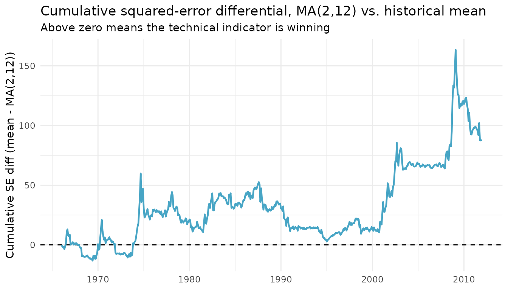

# Clark-West Tests on Equity Premium Forecasts

This article applies the Clark-West (2007) MSFE-adjusted test – exposed
by **forecastdom** as
[`cw_test()`](https://gabbocg.github.io/forecastdom/reference/cw_test.md)
– to two classic equity premium forecasting datasets bundled with the
package:

- `rz2013` – the 14 Goyal-Welch macroeconomic predictors used in Rapach
  and Zhou (2013), *Forecasting Stock Returns*, Handbook of Economic
  Forecasting, Vol. 2A, Chapter 6.
- `nrtz2014` – the 14 binary technical indicators (moving averages,
  momentum, on-balance volume) of Neely, Rapach, Tu, and Zhou (2014),
  *Forecasting the Equity Risk Premium*, *Management Science*.

The benchmark in both exercises is the prevailing historical mean of the
equity premium – the standard “no predictability” null in this
literature – and the alternatives are bivariate predictive regressions
on each single predictor.

``` r
library(forecastdom)
library(ggplot2)

data(rz2013)
data(nrtz2014)
```

## A reusable forecasting helper

The same recursive (expanding-window) loop is used for every predictor.
At each forecast date $t + 1$, the historical-mean benchmark uses
${\bar{y}}_{1:t}$; the alternative regresses $y_{2:t}$ on
$x_{1:{(t - 1)}}$ and forecasts using $x_{t}$.

``` r
recursive_forecasts <- function(y, x, R) {
  T_ <- length(y)
  P  <- T_ - R
  e1 <- e2 <- f1 <- f2 <- numeric(P)

  for (j in seq_len(P)) {
    # estimation sample: rows 1..(R+j-1); forecast target: row R+j
    train_y <- y[1:(R + j - 1)]
    train_x <- x[1:(R + j - 1)]

    # benchmark: prevailing mean of y observed up to t
    f1[j] <- mean(train_y)

    # alternative: y_t = a + b * x_{t-1} + e
    fit <- lm(yt ~ xlag, data = data.frame(
      yt   = train_y[-1],
      xlag = train_x[-length(train_x)]
    ))
    f2[j] <- as.numeric(stats::predict(
      fit, newdata = data.frame(xlag = train_x[length(train_x)])
    ))

    e1[j] <- y[R + j] - f1[j]
    e2[j] <- y[R + j] - f2[j]
  }

  list(e1 = e1, e2 = e2, f1 = f1, f2 = f2, P = P)
}
```

## Macro predictors (Rapach & Zhou, 2013)

We use the first 241 monthly observations (1926-12 through 1946-12) as
the initial estimation window and evaluate the next 768 months (1947-01
through 2010-12).

``` r
y_rz   <- rz2013$eq_prem
preds_rz <- setdiff(names(rz2013), c("date", "eq_prem"))
R_rz   <- 241L

cw_rz <- lapply(preds_rz, function(p) {
  fc <- recursive_forecasts(y_rz, rz2013[[p]], R = R_rz)
  res <- cw_test(fc$e1, fc$e2, fc$f1, fc$f2)
  data.frame(
    predictor = p,
    R2OS_pct  = unname(res$r2os),
    CW_stat   = unname(res$statistic),
    p_value   = unname(res$pvalue)
  )
})
cw_rz <- do.call(rbind, cw_rz)
cw_rz <- cw_rz[order(-cw_rz$CW_stat), ]

knitr::kable(cw_rz, digits = 3, row.names = FALSE,
             caption = "Clark-West test, macro predictors vs. historical mean (rz2013)")
```

| predictor | R2OS_pct | CW_stat | p_value |
|:----------|---------:|--------:|--------:|
| DY        |   -0.136 |   1.850 |   0.032 |
| DP        |    0.129 |   1.621 |   0.053 |
| EP        |   -1.452 |   1.469 |   0.071 |
| LTY       |   -0.815 |   1.392 |   0.082 |
| TBL       |   -0.043 |   1.308 |   0.095 |
| TMS       |    0.067 |   1.041 |   0.149 |
| SVAR      |    0.287 |   0.986 |   0.162 |
| BM        |   -1.335 |   0.787 |   0.216 |
| NTIS      |   -0.761 |   0.311 |   0.378 |
| INFL_lag  |   -0.086 |   0.047 |   0.481 |
| DFR       |   -0.268 |  -0.090 |   0.536 |
| LTR       |   -0.791 |  -0.177 |   0.570 |
| DE        |   -1.587 |  -0.347 |   0.636 |
| DFY       |   -0.179 |  -1.104 |   0.865 |

Clark-West test, macro predictors vs. historical mean (rz2013)

A positive `R2OS_pct` indicates the alternative model has a lower
out-of-sample MSFE than the historical-mean benchmark; the Clark-West
*t*-statistic is compared to a one-sided standard normal under
$H_{0}:\,\text{R}_{OS}^{2} \leq 0$.

## Technical indicators (Neely et al., 2014)

The technical indicators are binary signals constructed from S&P 500
prices and volume. We use the first 181 observations (1950-12 through
1965-12) as the initial estimation window and evaluate the next 552
months (1966-01 through 2011-12), matching the paper.

``` r
y_nr   <- nrtz2014$eq_prem
preds_nr <- setdiff(names(nrtz2014), c("date", "eq_prem"))
R_nr   <- 181L

cw_nr <- lapply(preds_nr, function(p) {
  fc <- recursive_forecasts(y_nr, nrtz2014[[p]], R = R_nr)
  res <- cw_test(fc$e1, fc$e2, fc$f1, fc$f2)
  data.frame(
    predictor = p,
    R2OS_pct  = unname(res$r2os),
    CW_stat   = unname(res$statistic),
    p_value   = unname(res$pvalue)
  )
})
cw_nr <- do.call(rbind, cw_nr)
cw_nr <- cw_nr[order(-cw_nr$CW_stat), ]

knitr::kable(cw_nr, digits = 3, row.names = FALSE,
             caption = "Clark-West test, technical indicators vs. historical mean (nrtz2014)")
```

| predictor | R2OS_pct | CW_stat | p_value |
|:----------|---------:|--------:|--------:|
| VOL_1_12  |    0.799 |   1.757 |   0.039 |
| MA_2_12   |    0.779 |   1.693 |   0.045 |
| VOL_3_12  |    0.709 |   1.681 |   0.046 |
| MA_1_12   |    0.633 |   1.518 |   0.065 |
| MA_3_9    |    0.414 |   1.406 |   0.080 |
| VOL_2_9   |    0.442 |   1.356 |   0.088 |
| VOL_1_9   |    0.403 |   1.251 |   0.105 |
| MA_2_9    |    0.324 |   1.157 |   0.124 |
| VOL_2_12  |    0.331 |   1.121 |   0.131 |
| MA_1_9    |    0.235 |   0.981 |   0.163 |
| MOM_12    |    0.154 |   0.686 |   0.247 |
| MA_3_12   |    0.077 |   0.634 |   0.263 |
| MOM_9     |    0.108 |   0.613 |   0.270 |
| VOL_3_9   |    0.014 |   0.457 |   0.324 |

Clark-West test, technical indicators vs. historical mean (nrtz2014)

Most technical indicators deliver positive R²OS and *Clark-West*
statistics that are significant at conventional levels, consistent with
the headline finding of Neely et al. (2014): simple price-based and
volume-based signals contain economically meaningful information for the
equity premium.

## A single deep-dive: MA(2, 12)

``` r
fc_ma <- recursive_forecasts(nrtz2014$eq_prem, nrtz2014$MA_2_12, R = R_nr)
cw_test(fc_ma$e1, fc_ma$e2, fc_ma$f1, fc_ma$f2)
#> 
#> ╭────────────────────────────────────────────────────╮
#> │               Clark-West Test (2007)               │
#> ├────────────────────────────────────────────────────┤
#> │ H0: Benchmark MSFE <= Alternative MSFE             │
#> │ H1: Alternative model is superior (R2OS > 0)       │
#> ├┄┄┄┄┄┄┄┄┄┄┄┄┄┄┄┄┄┄┄┄┄┄┄┄┄┄┄┄┄┄┄┄┄┄┄┄┄┄┄┄┄┄┄┄┄┄┄┄┄┄┄┄┤
#> │ Test Results:                                      │
#> │  CW statistic: 1.6925                              │
#> │  P-value (one-sided): 0.0453                       │
#> │  R2OS (%): 0.78                                    │
#> ├┄┄┄┄┄┄┄┄┄┄┄┄┄┄┄┄┄┄┄┄┄┄┄┄┄┄┄┄┄┄┄┄┄┄┄┄┄┄┄┄┄┄┄┄┄┄┄┄┄┄┄┄┤
#> │ Details:                                           │
#> │  Observations (n): 552                             │
#> │  Reference distribution: N(0,1)                    │
#> ╰────────────────────────────────────────────────────╯
```

The cumulative squared-error differential (Goyal-Welch, 2008) tracks
*when* the predictor outperforms the historical mean. An upward- sloping
line means the technical indicator is doing better; the steep gains tend
to cluster around recessions, exactly the regime documented by Neely et
al. (2014).

``` r
oos_dates <- tail(nrtz2014$date, fc_ma$P)
loss_diff <- fc_ma$e1^2 - fc_ma$e2^2

ggplot(data.frame(date = oos_dates, cum = cumsum(loss_diff)),
       aes(date, cum)) +
  geom_hline(yintercept = 0, linetype = "dashed") +
  geom_line(colour = "#47A5C5", linewidth = 0.8) +
  labs(x = NULL,
       y = "Cumulative SE diff (mean - MA(2,12))",
       title = "Cumulative squared-error differential, MA(2,12) vs. historical mean",
       subtitle = "Above zero means the technical indicator is winning") +
  theme_minimal(base_size = 11)
```



## Takeaways

- [`cw_test()`](https://gabbocg.github.io/forecastdom/reference/cw_test.md)
  is a one-line drop-in for any expanding-window equity premium
  forecasting exercise: feed it the two error series and the two
  forecast series, and read off the MSFE-adjusted statistic, the
  one-sided *p*-value, and $R_{OS}^{2}$.
- For the Goyal-Welch macro predictors (`rz2013`), out-of-sample gains
  over the historical mean are economically modest and only a handful of
  predictors are significant – the well-known “Goyal-Welch puzzle”.
- For the technical indicators (`nrtz2014`), most signals deliver
  positive $R_{OS}^{2}$ with significant Clark-West statistics, in line
  with the central message of Neely et al. (2014).

## References

- Clark, T. E. and West, K. D. (2007). Approximately normal tests for
  equal predictive accuracy in nested models. *Journal of Econometrics*,
  138(1), 291-311.
- Goyal, A. and Welch, I. (2008). A comprehensive look at the empirical
  performance of equity premium prediction. *Review of Financial
  Studies*, 21(4), 1455-1508.
- Neely, C. J., Rapach, D. E., Tu, J., and Zhou, G. (2014). Forecasting
  the equity risk premium: The role of technical indicators. *Management
  Science*, 60(7), 1772-1791.
- Rapach, D. E. and Zhou, G. (2013). Forecasting stock returns. In G.
  Elliott and A. Timmermann (Eds.), *Handbook of Economic Forecasting*,
  Vol. 2A, pp. 328-383. Elsevier.
