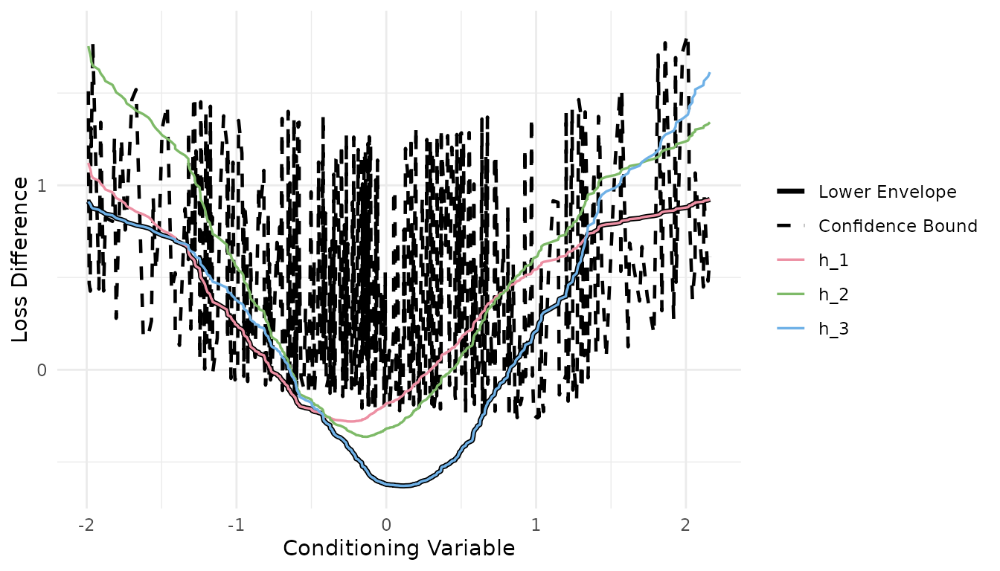

# Get Started with forecastdom

## Overview

**forecastdom** collects forecast evaluation tests under the taxonomy of
Li, Liao, and Quaedvlieg (2022):

|                   | **Equal accuracy**                                                        | **Superior accuracy**                                                         |
|-------------------|---------------------------------------------------------------------------|-------------------------------------------------------------------------------|
| **Unconditional** | [`dm_test()`](https://gabbocg.github.io/forecastdom/reference/dm_test.md) | [`spa_test()`](https://gabbocg.github.io/forecastdom/reference/spa_test.md)   |
| **Conditional**   | [`gw_test()`](https://gabbocg.github.io/forecastdom/reference/gw_test.md) | [`cspa_test()`](https://gabbocg.github.io/forecastdom/reference/cspa_test.md) |

It also bundles the tests usually paired with these in applied work:
nested-model comparisons
([`cw_test()`](https://gabbocg.github.io/forecastdom/reference/cw_test.md),
[`enc_new()`](https://gabbocg.github.io/forecastdom/reference/enc_new.md),
[`mse_f_test()`](https://gabbocg.github.io/forecastdom/reference/mse_f_test.md)),
return predictability
([`ivx_wald()`](https://gabbocg.github.io/forecastdom/reference/ivx_wald.md)),
and parameter instability
([`qll_hat()`](https://gabbocg.github.io/forecastdom/reference/qll_hat.md)).

``` r
library(forecastdom)
set.seed(42)
```

## Pairwise Forecast Comparison

### Diebold-Mariano test

Compares two sets of forecast errors and asks whether the average loss
differential is zero.

``` r
e1 <- rnorm(200)
e2 <- rnorm(200, mean = 0.15)

dm_test(e1, e2)
#> 
#> ╭────────────────────────────────────────────────────╮
#> │     Modified Diebold-Mariano Test (HLN, 1997)      │
#> ├────────────────────────────────────────────────────┤
#> │ H0: Equal predictive ability                       │
#> │ H1: Methods have different predictive ability      │
#> ├┄┄┄┄┄┄┄┄┄┄┄┄┄┄┄┄┄┄┄┄┄┄┄┄┄┄┄┄┄┄┄┄┄┄┄┄┄┄┄┄┄┄┄┄┄┄┄┄┄┄┄┄┤
#> │ Test Results:                                      │
#> │  DM statistic: 0.2073                              │
#> │  P-value: 0.8360                                   │
#> ├┄┄┄┄┄┄┄┄┄┄┄┄┄┄┄┄┄┄┄┄┄┄┄┄┄┄┄┄┄┄┄┄┄┄┄┄┄┄┄┄┄┄┄┄┄┄┄┄┄┄┄┄┤
#> │ Details:                                           │
#> │  Observations (n): 200                             │
#> │  Forecast horizon (h): 1                           │
#> │  Loss function: SE                                 │
#> │  Reference distribution: t(199)                    │
#> ╰────────────────────────────────────────────────────╯
```

The default `correction = TRUE` applies the Harvey, Leybourne, and
Newbold (1997) small-sample correction, which uses a $t$ distribution
with $T - 1$ degrees of freedom in place of the asymptotic normal.

### Clark-West test

The standard DM test is undersized when the two models are nested. The
Clark-West (2007) MSFE-adjusted statistic fixes this by adding a
correction term for the extra parameters in the larger model and is
approximately $N(0,1)$ under the null.

``` r
actual <- rnorm(200)
f1 <- actual + rnorm(200, sd = 0.5) # benchmark (restricted)
f2 <- actual + rnorm(200, sd = 0.4) # alternative (unrestricted)

cw_test(actual - f1, actual - f2, f1, f2)
#> 
#> ╭────────────────────────────────────────────────────╮
#> │               Clark-West Test (2007)               │
#> ├────────────────────────────────────────────────────┤
#> │ H0: Benchmark MSFE <= Alternative MSFE             │
#> │ H1: Alternative model is superior (R2OS > 0)       │
#> ├┄┄┄┄┄┄┄┄┄┄┄┄┄┄┄┄┄┄┄┄┄┄┄┄┄┄┄┄┄┄┄┄┄┄┄┄┄┄┄┄┄┄┄┄┄┄┄┄┄┄┄┄┤
#> │ Test Results:                                      │
#> │  CW statistic: 9.1803                              │
#> │  P-value (one-sided): 0.0000                       │
#> │  R2OS (%): 10.18                                   │
#> ├┄┄┄┄┄┄┄┄┄┄┄┄┄┄┄┄┄┄┄┄┄┄┄┄┄┄┄┄┄┄┄┄┄┄┄┄┄┄┄┄┄┄┄┄┄┄┄┄┄┄┄┄┤
#> │ Details:                                           │
#> │  Observations (n): 200                             │
#> │  Reference distribution: N(0,1)                    │
#> ╰────────────────────────────────────────────────────╯
```

### Giacomini-White test

Asks whether two methods have equal predictive ability *given* the
information available to the forecaster. The default instruments are a
constant and the lagged loss differential.

``` r
gw_test(e1, e2)
#> 
#> ╭────────────────────────────────────────────────────╮
#> │     Conditional Equal Predictive Ability Test      │
#> │            (Giacomini and White, 2006)             │
#> ├────────────────────────────────────────────────────┤
#> │ H0: Equal conditional predictive ability           │
#> │ H1: Methods differ conditionally                   │
#> ├┄┄┄┄┄┄┄┄┄┄┄┄┄┄┄┄┄┄┄┄┄┄┄┄┄┄┄┄┄┄┄┄┄┄┄┄┄┄┄┄┄┄┄┄┄┄┄┄┄┄┄┄┤
#> │ Test Results:                                      │
#> │  Wald statistic: 1.3426                            │
#> │  P-value: 0.5110                                   │
#> ├┄┄┄┄┄┄┄┄┄┄┄┄┄┄┄┄┄┄┄┄┄┄┄┄┄┄┄┄┄┄┄┄┄┄┄┄┄┄┄┄┄┄┄┄┄┄┄┄┄┄┄┄┤
#> │ Details:                                           │
#> │  Observations (n): 199                             │
#> │  Instruments (q): 2                                │
#> │  Loss function: SE                                 │
#> │  Reference distribution: Chi-sq(2)                 │
#> ╰────────────────────────────────────────────────────╯
```

## Multiple Forecast Comparison

### Hansen’s SPA test

Asks whether the benchmark has the lowest expected loss among all
competitors. The null is that no competitor beats the benchmark on
average; the bootstrap controls family-wise error across the $J$
comparisons.

``` r
sim <- do_sim(J = 3, n = 250, a = 1, c = 0, rho_u = 0.4)
spa_test(sim$Y, level = 0.05, B = 1000)
#> 
#> ╭────────────────────────────────────────────────────╮
#> │          Superior Predictive Ability Test          │
#> │                   (Hansen, 2005)                   │
#> ├────────────────────────────────────────────────────┤
#> │ H0: Benchmark is superior to all competitors       │
#> │ H1: Some competitor outperforms the benchmark      │
#> ├┄┄┄┄┄┄┄┄┄┄┄┄┄┄┄┄┄┄┄┄┄┄┄┄┄┄┄┄┄┄┄┄┄┄┄┄┄┄┄┄┄┄┄┄┄┄┄┄┄┄┄┄┤
#> │ Test Results:                                      │
#> │  SPA statistic: 50.4916                            │
#> │  P-value (bootstrap): 0.0020                       │
#> │  Decision: Rejected ***                            │
#> ├┄┄┄┄┄┄┄┄┄┄┄┄┄┄┄┄┄┄┄┄┄┄┄┄┄┄┄┄┄┄┄┄┄┄┄┄┄┄┄┄┄┄┄┄┄┄┄┄┄┄┄┄┤
#> │ Details:                                           │
#> │  Observations (n): 250                             │
#> │  Competitors (J): 3                                │
#> │  Bootstrap replications: 1000                      │
#> │  Significance level: 0.0500                        │
#> ╰────────────────────────────────────────────────────╯
```

### CSPA test

Li, Liao, and Quaedvlieg (2022) ask the same question conditional on a
state variable $X_{t}$. The null is

$$H_{0}:\ \min\limits_{j}\,{\mathbb{E}}\left\lbrack L_{0,t} - L_{j,t} \mid X_{t} = x \right\rbrack \leq 0\quad{\text{for all}\mspace{6mu}}x,$$

i.e. there is no competitor and no state value where the benchmark is
strictly worse. The test combines a Legendre-polynomial series estimate
of the conditional mean differentials $h_{j}(x)$ with an HAC-based
Gaussian-process critical value.

``` r
# Under the null (a = 1) the benchmark is weakly dominant
sim_null <- do_sim(J = 3, n = 500, a = 1, c = 0, rho_u = 0.4)
cspa_test(sim_null$Y, sim_null$X, level = 0.05, trim = 2)
#> 
#> ╭────────────────────────────────────────────────────╮
#> │      Conditional Superior Predictive Ability       │
#> │          (Li, Liao, and Quaedvlieg, 2022)          │
#> ├────────────────────────────────────────────────────┤
#> │ H0: Benchmark weakly dominates all competitors     │
#> │     conditionally, uniformly across all states     │
#> │ H1: Some competitor outperforms the benchmark      │
#> │     in certain conditioning states                 │
#> ├┄┄┄┄┄┄┄┄┄┄┄┄┄┄┄┄┄┄┄┄┄┄┄┄┄┄┄┄┄┄┄┄┄┄┄┄┄┄┄┄┄┄┄┄┄┄┄┄┄┄┄┄┤
#> │ Test Results:                                      │
#> │  Theta: 0.1488                                     │
#> │  P-value: 0.4666                                   │
#> │  Significance level: 0.0500                        │
#> │  Decision: Not rejected                            │
#> ├┄┄┄┄┄┄┄┄┄┄┄┄┄┄┄┄┄┄┄┄┄┄┄┄┄┄┄┄┄┄┄┄┄┄┄┄┄┄┄┄┄┄┄┄┄┄┄┄┄┄┄┄┤
#> │ Estimation Details:                                │
#> │  Observations (n): 480                             │
#> │  Competitors (J): 3                                │
#> │  Series terms (K): 4                               │
#> │  HAC lag order: 1 (pre-whitened)                   │
#> │  Selected (j,x) pairs: 1440 / 1440 (100.0%)        │
#> ╰────────────────────────────────────────────────────╯
```

``` r
# Under the alternative (a = 1.5) one competitor beats the benchmark in some states
sim_alt <- do_sim(J = 3, n = 500, a = 1.5, c = 0, rho_u = 0.4)
result <- cspa_test(sim_alt$Y, sim_alt$X, level = 0.05, trim = 2)

result
#> 
#> ╭────────────────────────────────────────────────────╮
#> │      Conditional Superior Predictive Ability       │
#> │          (Li, Liao, and Quaedvlieg, 2022)          │
#> ├────────────────────────────────────────────────────┤
#> │ H0: Benchmark weakly dominates all competitors     │
#> │     conditionally, uniformly across all states     │
#> │ H1: Some competitor outperforms the benchmark      │
#> │     in certain conditioning states                 │
#> ├┄┄┄┄┄┄┄┄┄┄┄┄┄┄┄┄┄┄┄┄┄┄┄┄┄┄┄┄┄┄┄┄┄┄┄┄┄┄┄┄┄┄┄┄┄┄┄┄┄┄┄┄┤
#> │ Test Results:                                      │
#> │  Theta: -0.2217                                    │
#> │  P-value: 0.0002                                   │
#> │  Significance level: 0.0500                        │
#> │  Decision: Rejected ***                            │
#> ├┄┄┄┄┄┄┄┄┄┄┄┄┄┄┄┄┄┄┄┄┄┄┄┄┄┄┄┄┄┄┄┄┄┄┄┄┄┄┄┄┄┄┄┄┄┄┄┄┄┄┄┄┤
#> │ Estimation Details:                                │
#> │  Observations (n): 480                             │
#> │  Competitors (J): 3                                │
#> │  Series terms (K): 4                               │
#> │  HAC lag order: 1 (pre-whitened)                   │
#> │  Selected (j,x) pairs: 1440 / 1440 (100.0%)        │
#> ╰────────────────────────────────────────────────────╯
```

### Visualization

[`cspa_test_plot()`](https://gabbocg.github.io/forecastdom/reference/cspa_test_plot.md)
draws the estimated conditional means ${\widehat{h}}_{j}(x)$, their
lower envelope, and the upper confidence bound on that envelope. The
CSPA null is rejected when the dashed bound drops below zero anywhere on
the support of $x$.

``` r
cspa_test_plot(result)
```



### CSMS: confidence set for the most superior

If no model is singled out as the benchmark,
[`csms()`](https://gabbocg.github.io/forecastdom/reference/csms.md) runs
the CSPA test once per candidate and keeps the candidates that are *not*
rejected. The resulting set is asymptotically a level-$(1 - \alpha)$
confidence set for the conditionally most-superior method.

``` r
csms(losses, X, level = 0.05, trim = 2, method_names = c("AR1", "HAR", "HARQ", "LASSO"))
```

## Predictive Regressions

### IVX-Wald test

Kostakis, Magdalinos, and Stamatogiannis (2015) build an instrument from
a near-stationary transformation of the regressor so that the
predictability test has a standard $\chi^{2}$ distribution even when the
predictor is near-unit-root.

``` r
n <- 300
x <- cumsum(rnorm(n))
y <- 0.02 * x + rnorm(n)

ivx_wald(y, as.matrix(x), K = 1, M_n = floor(n^(1/3)))
#> 
#> ╭────────────────────────────────────────────────────╮
#> │      IVX-Wald Test for Predictive Regressions      │
#> │  (Kostakis, Magdalinos, and Stamatogiannis, 2015)  │
#> ├────────────────────────────────────────────────────┤
#> │ H0: No predictability (all coefficients = 0)       │
#> │ H1: At least one predictor is significant          │
#> ├┄┄┄┄┄┄┄┄┄┄┄┄┄┄┄┄┄┄┄┄┄┄┄┄┄┄┄┄┄┄┄┄┄┄┄┄┄┄┄┄┄┄┄┄┄┄┄┄┄┄┄┄┤
#> │ Test Results:                                      │
#> │  IVX-Wald statistic: 13.4596                       │
#> │  P-value: 0.0002                                   │
#> ├┄┄┄┄┄┄┄┄┄┄┄┄┄┄┄┄┄┄┄┄┄┄┄┄┄┄┄┄┄┄┄┄┄┄┄┄┄┄┄┄┄┄┄┄┄┄┄┄┄┄┄┄┤
#> │ Details:                                           │
#> │  Observations (T): 300                             │
#> │  Predictors (r): 1                                 │
#> │  Forecast horizon (K): 1                           │
#> │  Reference distribution: Chi-sq(1)                 │
#> ├┄┄┄┄┄┄┄┄┄┄┄┄┄┄┄┄┄┄┄┄┄┄┄┄┄┄┄┄┄┄┄┄┄┄┄┄┄┄┄┄┄┄┄┄┄┄┄┄┄┄┄┄┤
#> │ IVX Coefficients:                                  │
#> │    beta_1: 0.0249                                  │
#> ╰────────────────────────────────────────────────────╯
```

### Elliott-Muller test

Tests $H_{0}:\ \beta_{t} = \beta$ for all $t$ against the alternative
that the regression coefficient drifts. The statistic $\widehat{qLL}$
has a non-standard limit; critical values are tabulated in Elliott and
Muller (2006, Table 1).

``` r
X <- matrix(rnorm(n * 2), n, 2)
y2 <- X %*% c(0.5, -0.3) + rnorm(n)

qll_hat(y2, X, L = floor(n ^ (1 / 3)))
#> 
#> ╭────────────────────────────────────────────────────╮
#> │ Elliott-Muller Test for Time-Varying Coefficients  │
#> │             (Elliott and Muller, 2006)             │
#> ├────────────────────────────────────────────────────┤
#> │ H0: Constant coefficients (beta(t) = beta)         │
#> │ H1: Time-varying coefficients                      │
#> ├┄┄┄┄┄┄┄┄┄┄┄┄┄┄┄┄┄┄┄┄┄┄┄┄┄┄┄┄┄┄┄┄┄┄┄┄┄┄┄┄┄┄┄┄┄┄┄┄┄┄┄┄┤
#> │ Test Results:                                      │
#> │  qLL-hat statistic: -7.2358                        │
#> │  5% critical value: -10.64                         │
#> │  Decision (5%): Not rejected                       │
#> ├┄┄┄┄┄┄┄┄┄┄┄┄┄┄┄┄┄┄┄┄┄┄┄┄┄┄┄┄┄┄┄┄┄┄┄┄┄┄┄┄┄┄┄┄┄┄┄┄┄┄┄┄┤
#> │ Details:                                           │
#> │  Observations (T): 300                             │
#> │  Time-varying coefficients (k): 2                  │
#> │ Note: Non-standard distribution.                   │
#> │ Reject when qLL-hat < critical value.              │
#> ╰────────────────────────────────────────────────────╯
```

## References

- Clark, T.E. and McCracken, M.W. (2001). Tests of Equal Forecast
  Accuracy and Encompassing for Nested Models. *Journal of
  Econometrics*, 105(1), 85-110.
- Clark, T.E. and West, K.D. (2007). Approximately Normal Tests for
  Equal Predictive Accuracy in Nested Models. *Journal of Econometrics*,
  138(1), 291-311.
- Diebold, F.X. and Mariano, R.S. (1995). Comparing Predictive Accuracy.
  *Journal of Business & Economic Statistics*, 13(3), 253-263.
- Elliott, G. and Muller, U.K. (2006). Efficient Tests for General
  Persistent Time Variation in Regression Coefficients. *Review of
  Economic Studies*, 73(4), 907-940.
- Giacomini, R. and White, H. (2006). Tests of Conditional Predictive
  Ability. *Econometrica*, 74(6), 1545-1578.
- Hansen, P.R. (2005). A Test for Superior Predictive Ability. *Journal
  of Business & Economic Statistics*, 23(4), 365-380.
- Harvey, D., Leybourne, S., and Newbold, P. (1997). Testing the
  Equality of Prediction Mean Squared Errors. *International Journal of
  Forecasting*, 13(2), 281-291.
- Kostakis, A., Magdalinos, T., and Stamatogiannis, M.P. (2015). Robust
  Econometric Inference for Stock Return Predictability. *Review of
  Financial Studies*, 28(5), 1506-1553.
- Li, J., Liao, Z., and Quaedvlieg, R. (2022). Conditional Superior
  Predictive Ability. *Review of Economic Studies*, 89(2), 843-875.
