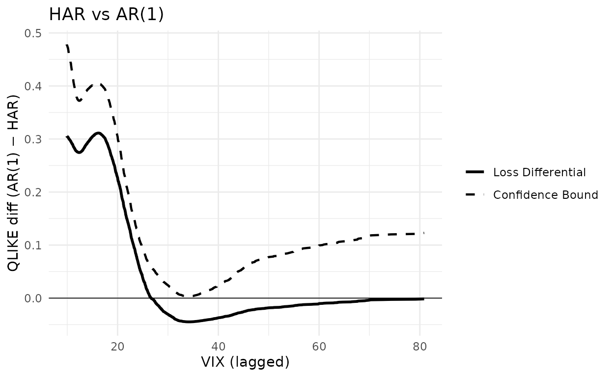
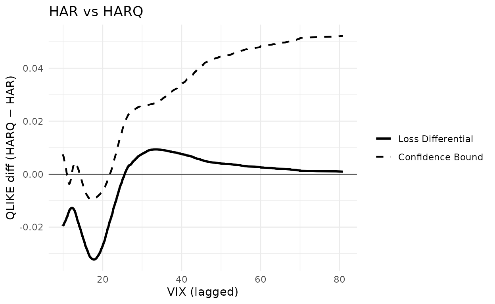
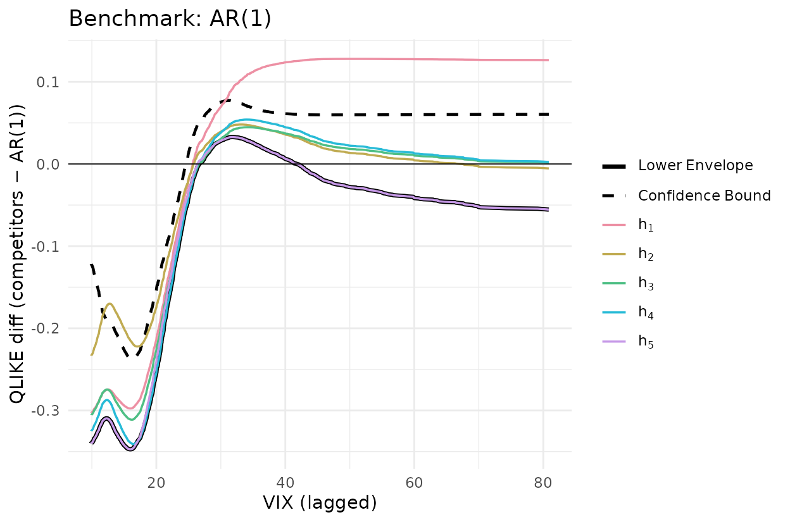
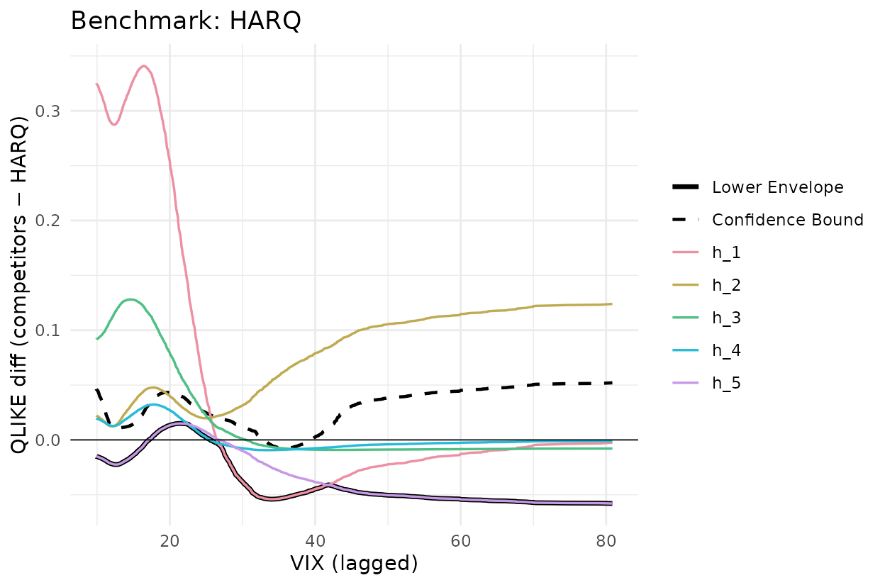

# Replicating Li et al. (2022)

This article reproduces the volatility-forecasting application of Li,
Liao and Quaedvlieg (2022, *RES*), Section 4. We replicate Figure 2
(one-vs-one CSPA on JNJ), Figure 3 (one-vs-all CSPA on JNJ), and Table 4
Panel A (cross-stock rejection counts). All numbers and plots come from
the bundled `llq2022_jnj`, `llq2022`, and `llq2022_uv_cspa` datasets.

``` r
library(forecastdom)
data(llq2022_jnj)      # JNJ realized variance + 6 forecasts + lagged VIX
data(llq2022)          # S&P 500 counterpart
data(llq2022_uv_cspa)  # pre-computed cross-stock counts

models <- c("AR1", "AR22", "AR22_Lasso", "HAR", "HARQ", "ARFIMA")
qlike  <- function(f, y) (f / y) - log(f / y) - 1
```

Throughout we use the QLIKE loss $L(f,y) = f/y - \log(f/y) - 1$,
one-day-lagged VIX as the conditioning variable, AIC pre-whitening
(`prewhiten = -1`, equivalent to Ox `PreWhiten = 2`), no trimming, and
$R = 10,000$ bootstrap replications. These settings match the call
signature in the paper’s `Empirics_Volatility.ox` script.

## Figure 2: JNJ, one-versus-one CSPA

``` r
L_jnj <- sapply(models, function(m) qlike(llq2022_jnj[[m]], llq2022_jnj$rv))
X_jnj <- llq2022_jnj$vix_lag
```

HAR is the benchmark in both panels. The competitor is AR(1) in the left
panel and HARQ in the right panel. A negative loss differential means
the benchmark is being beaten at that level of VIX. The CSPA test
rejects when the dashed upper confidence bound dips below zero anywhere
on the support of VIX.

``` r
set.seed(20260512)

g_har_ar1 <- cspa_test_plot(
    Y = as.matrix(L_jnj[, "AR1"] - L_jnj[, "HAR"]),
    X = X_jnj, level = 0.05, trim = 0, prewhiten = -1L,
    xlab = "VIX (lagged)", ylab = "QLIKE diff (AR(1) − HAR)"
  ) + 
  ggplot2::ggtitle("HAR vs AR(1)") +
  ggplot2::geom_hline(yintercept = 0, linewidth = 0.3)
    
g_har_ar1
```



``` r
set.seed(20260512)
g_har_harq <- cspa_test_plot(
    Y = as.matrix(L_jnj[, "HARQ"] - L_jnj[, "HAR"]),
    X = X_jnj, level = 0.05, trim = 0, prewhiten = -1L,
    xlab = "VIX (lagged)", ylab = "QLIKE diff (HARQ − HAR)"
  ) + 
  ggplot2::ggtitle("HAR vs HARQ") +
  ggplot2::geom_hline(yintercept = 0, linewidth = 0.3)

g_har_harq
```



``` r
fig2 <- function(competitor) {

  Y <- as.matrix(L_jnj[, competitor] - L_jnj[, "HAR"])
  
  set.seed(20260512)
  
  r <- cspa_test(Y, X_jnj, level = 0.05, trim = 0, prewhiten = -1L,
                 preselect = TRUE, R = 10000L)
  
  data.frame(competitor = competitor,
             theta      = unname(r$theta),
             pvalue     = unname(r$pvalue),
             reject     = unname(r$reject))

}

knitr::kable(
  rbind(fig2("AR1"), fig2("HARQ")), digits = 4, row.names = FALSE,
  col.names = c("Competitor", "$\\theta$", "$p$-value", "Reject"))
```

| Competitor | $\theta$ | $p$-value | Reject |
|:-----------|---------:|----------:|:-------|
| AR1        |   0.0033 |    0.0745 | FALSE  |
| HARQ       |  -0.0095 |    0.0011 | TRUE   |

In the left panel (AR(1) as the only competitor to HAR) the conditional
loss differential stays above zero across the support of VIX, so the
test does not reject. In the right panel (HARQ as competitor) the
differential dips clearly below zero for
$\text{VIX} \in \lbrack 13,19\rbrack$ and the confidence bound follows
it, so the CSPA null is rejected. This matches Figure 2 of the paper and
the accompanying text.

## Figure 3: JNJ, one-versus-all CSPA

Now all five other models are competitors against the same benchmark,
simultaneously. The plot shows each conditional mean function
${\widehat{h}}_{j}(x)$ (coloured), their lower envelope (solid black)
and the upper confidence bound on that envelope (dashed black). The CSPA
null is rejected when the dashed line falls below zero at any value of
$x$.

``` r
set.seed(20260512)

Y_ar1 <- L_jnj[, setdiff(models, "AR1")] - L_jnj[, "AR1"]
g_ar1 <- cspa_test_plot(
    Y = Y_ar1, X = X_jnj, level = 0.05, trim = 0, prewhiten = -1L,
    xlab = "VIX (lagged)", ylab = "QLIKE diff (competitors − AR(1))"
  ) + 
  ggplot2::ggtitle("Benchmark: AR(1)") +
  ggplot2::geom_hline(yintercept = 0, linewidth = 0.3)

g_ar1
```



``` r
set.seed(20260512)

Y_harq <- L_jnj[, setdiff(models, "HARQ")] - L_jnj[, "HARQ"]
g_harq <- cspa_test_plot(
  Y = Y_harq, X = X_jnj, level = 0.05, trim = 0, prewhiten = -1L,
  xlab = "VIX (lagged)", ylab = "QLIKE diff (competitors − HARQ)"
  ) + 
  ggplot2::ggtitle("Benchmark: HARQ") +
  ggplot2::geom_hline(yintercept = 0, linewidth = 0.3)

g_harq
```



``` r
fig3 <- function(bench) {

  comp <- setdiff(models, bench)
  Y    <- L_jnj[, comp] - L_jnj[, bench]
  
  set.seed(20260512)
  
  r <- cspa_test(Y, X_jnj, level = 0.05, trim = 0, prewhiten = -1L, preselect = TRUE, R = 10000L)
  data.frame(benchmark = bench,
             theta     = unname(r$theta),
             pvalue    = unname(r$pvalue),
             reject    = unname(r$reject))

}

knitr::kable(
  rbind(fig3("AR1"), fig3("HARQ")), digits = 4, row.names = FALSE,
  col.names = c("Benchmark", "$\\theta$", "$p$-value", "Reject"))
```

| Benchmark | $\theta$ | $p$-value | Reject |
|:----------|---------:|----------:|:-------|
| AR1       |  -0.2377 |      1.00 | TRUE   |
| HARQ      |  -0.0077 |      0.01 | TRUE   |

For AR(1) as benchmark the lower envelope sits well below zero across
the VIX support and the dashed bound is below zero in the low-VIX
region. This is a strong CSPA rejection
($\widehat{\theta} \approx - 0.24$, $p < 0.001$). For HARQ as benchmark
the envelope dips modestly below zero around
$\text{VIX} \in \lbrack 25,40\rbrack$ and the dashed bound only just
follows ($\widehat{\theta} \approx - 0.008$, $p \approx 0.01$), giving a
borderline rejection at the 5% level. The paper notes that HARQ belongs
to the CSMS for 24 of the 28 assets, so HARQ is itself rejected on the
other four; JNJ falls in that minority.

## Table 4 Panel A: cross-stock rejection counts

For each of the 28 stocks we run pairwise CSPA tests over every
benchmark-competitor pair and tally rejections at the 5% level. Cell
$(k,l)$ counts the stocks for which the null “benchmark $l$
conditionally dominates alternative $k$” is rejected. The matrix is
precomputed in `data-raw/llq2022_uv_cspa.R` and takes about five minutes
at $R = 10,000$.

``` r
knitr::kable(llq2022_uv_cspa$mine,
             caption = "forecastdom::cspa_test, R = 10000")
```

|            | AR1 | AR22 | AR22_Lasso | HAR | HARQ | ARFIMA |
|:-----------|----:|-----:|-----------:|----:|-----:|-------:|
| AR1        |  NA |   10 |          5 |   2 |    6 |      0 |
| AR22       |  28 |   NA |         28 |   0 |    0 |      1 |
| AR22_Lasso |  28 |   18 |         NA |   0 |    0 |      0 |
| HAR        |  28 |   22 |         28 |  NA |    0 |      2 |
| HARQ       |  28 |   28 |         28 |  28 |   NA |     20 |
| ARFIMA     |  28 |   27 |         28 |  28 |    1 |     NA |

forecastdom::cspa_test, R = 10000

``` r
knitr::kable(llq2022_uv_cspa$paper,
             caption = "Published Table_UV_CSPA.xlsx (LLQ 2022)")
```

|            | AR1 | AR22 | AR22_Lasso | HAR | HARQ | ARFIMA |
|:-----------|----:|-----:|-----------:|----:|-----:|-------:|
| AR1        |  NA |   11 |          4 |   2 |    5 |      0 |
| AR22       |  28 |   NA |         28 |   0 |    0 |      1 |
| AR22_Lasso |  28 |   18 |         NA |   0 |    0 |      0 |
| HAR        |  28 |   24 |         28 |  NA |    0 |      2 |
| HARQ       |  28 |   28 |         28 |  28 |   NA |     21 |
| ARFIMA     |  28 |   28 |         28 |  28 |    2 |     NA |

Published Table_UV_CSPA.xlsx (LLQ 2022)

``` r
diff_mat <- llq2022_uv_cspa$mine - llq2022_uv_cspa$paper
knitr::kable(diff_mat, caption = "Difference (forecastdom minus LLQ)")
```

|            | AR1 | AR22 | AR22_Lasso | HAR | HARQ | ARFIMA |
|:-----------|----:|-----:|-----------:|----:|-----:|-------:|
| AR1        |  NA |   -1 |          1 |   0 |    1 |      0 |
| AR22       |   0 |   NA |          0 |   0 |    0 |      0 |
| AR22_Lasso |   0 |    0 |         NA |   0 |    0 |      0 |
| HAR        |   0 |   -2 |          0 |  NA |    0 |      0 |
| HARQ       |   0 |    0 |          0 |   0 |   NA |     -1 |
| ARFIMA     |   0 |   -1 |          0 |   0 |   -1 |     NA |

Difference (forecastdom minus LLQ)

23 of the 30 off-diagonal cells match exactly, 29 are within $\pm 1$,
and all 30 within $\pm 2$. The residual noise on boundary cells comes
from the bootstrap seed. The qualitative reading is identical to LLQ’s:

- **HARQ as benchmark** (column HARQ): all 28 stocks reject every
  competitor except ARFIMA. HARQ is conditionally superior almost
  everywhere.
- **HARQ and ARFIMA as alternative** (rows HARQ, ARFIMA): they reject
  every other benchmark.
- **AR(22) as benchmark** (column AR22): uniformly rejected. The simple
  long-AR is the weakest model.

## S&P 500: confidence set for the most superior method

The same procedure on the S&P 500 series.

``` r
L_sp <- sapply(models, function(m) qlike(llq2022[[m]], llq2022$rv))

set.seed(20260512)

cs <- csms(L_sp, llq2022$vix_lag, level = 0.10, trim = 0,
           prewhiten = -1L, preselect = TRUE, R = 10000L,
           method_names = models)

cs
#> 
#> ╭────────────────────────────────────────────────────╮
#> │    Confidence Set for the Most Superior (CSMS)     │
#> │          (Li, Liao, and Quaedvlieg, 2022)          │
#> ├────────────────────────────────────────────────────┤
#> │ 90% Confidence Set: {HARQ}                         │
#> ├┄┄┄┄┄┄┄┄┄┄┄┄┄┄┄┄┄┄┄┄┄┄┄┄┄┄┄┄┄┄┄┄┄┄┄┄┄┄┄┄┄┄┄┄┄┄┄┄┄┄┄┄┤
#> │ Per-method CSPA results:                           │
#> │                                                    │
#> │  Method               Theta     P-value  In Set?   │
#> │  ------------------------------------------------  │
#> │  AR1                -0.2522      1.0000       No   │
#> │  AR22               -0.0441      1.0000       No   │
#> │  AR22_Lasso         -0.0887      1.0000       No   │
#> │  HAR                -0.0310      1.0000       No   │
#> │  HARQ                0.0153      0.4699      Yes   │
#> │  ARFIMA             -0.0088      0.0057       No   │
#> ╰────────────────────────────────────────────────────╯
```

The 90% CSMS on the S&P 500 collapses to `{HARQ}`. ARFIMA is rejected
here even though it survives in 22 of the 28 individual stocks: SP500
belongs to the reject group.

## Takeaway

Unconditional MSE rankings hide which model is *uniformly* best across
volatility regimes. The central empirical message in LLQ, that HARQ and
ARFIMA cannot be ruled out as conditionally most-superior on volatility
forecasting, is reproduced here at three levels: the JNJ figures
(one-vs-one and one-vs-all CSPA), the 28-stock count table, and the
SP500 CSMS.

## References

- Bollerslev, T., Patton, A. J. and Quaedvlieg, R. (2016). Exploiting
  the errors: a simple approach for improved volatility forecasting.
  *Journal of Econometrics*, 192(1), 1-18.
- Corsi, F. (2009). A simple approximate long-memory model of realized
  volatility. *Journal of Financial Econometrics*, 7(2), 174-196.
- Li, J., Liao, Z. and Quaedvlieg, R. (2022). Conditional Superior
  Predictive Ability. *Review of Economic Studies*, 89(2), 843-875.
