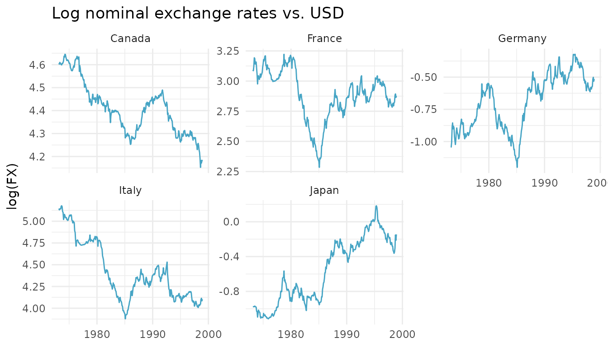
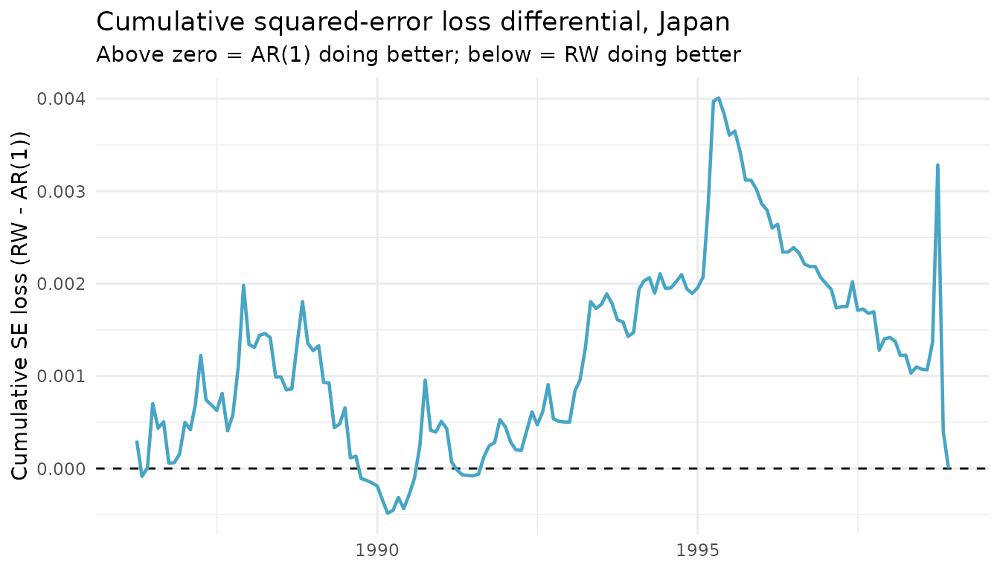

# Replicating Rossi (2006), Table 1: Out-of-Sample Tests

This article replicates the **out-of-sample portion of Table 1** in
Rossi (2006), *“Are exchange rates really random walks? Some evidence
robust to parameter instability”* (*Macroeconomic Dynamics*, 10(1),
20-38), using two functions from **forecastdom**:

- [`dm_test()`](https://gabbocg.github.io/forecastdom/reference/dm_test.md)
  – the Diebold-Mariano (1995) test of equal predictive accuracy.
- [`enc_new()`](https://gabbocg.github.io/forecastdom/reference/enc_new.md)
  – the Clark-McCracken (2001) ENC-NEW encompassing test for nested
  models.

The exercise is the classical Meese-Rogoff (1983) question: at the
monthly horizon, can a small linear AR model of exchange-rate returns
beat a driftless random walk out of sample?

``` r
library(forecastdom)
library(ggplot2)

data(rossi2006)
str(rossi2006)
#> 'data.frame':    1550 obs. of  3 variables:
#>  $ date   : Date, format: "1973-03-01" "1973-04-01" ...
#>  $ country: Factor w/ 5 levels "Canada","France",..: 1 1 1 1 1 1 1 1 1 1 ...
#>  $ fx     : num  100.1 99.7 100.5 100.2 99.8 ...
```

## The data

Five bilateral nominal exchange rates against the U.S. dollar (Canada,
France, Germany, Italy, Japan), monthly from March 1973 to December 1998
– 310 observations per country.

``` r
ggplot(rossi2006, aes(date, log(fx))) +
  geom_line(colour = "#47A5C5") +
  facet_wrap(~ country, scales = "free_y") +
  labs(x = NULL, y = "log(FX)",
       title = "Log nominal exchange rates vs. USD") +
  theme_minimal(base_size = 11)
```



## Forecasting setup

Let $e_{t}$ denote the log exchange rate and
$\Delta e_{t} = e_{t} - e_{t - 1}$ its monthly return. Two competing
one-step-ahead forecasts of $\Delta e_{t + 1}$:

- **Benchmark – driftless random walk:**
  ${\widehat{\Delta e}}_{t + 1}^{RW} = 0$.
- **Alternative – AR(*p*):**
  ${\widehat{\Delta e}}_{t + 1}^{AR} = {\widehat{\alpha}}_{t} + \sum_{k = 1}^{p}{\widehat{\beta}}_{k,t}\,\Delta e_{t - k + 1}$,
  with coefficients re-estimated each period.

Following Rossi, both AR(1) and AR(2) start from the same usable sample:
dropping the first three observations of $e_{t}$ gives
$n_{obs} = T - 3 = 307$ usable monthly returns. The first
$R = \lceil n_{obs}/2\rceil = 154$ are used to fit the initial model and
the remaining $P = 153$ are evaluated out of sample.

The paper considers three estimation schemes:

- **Split (fixed window)** – coefficients estimated once on $1:R$ and
  held fixed.
- **Recursive (expanding window)** – coefficients re-estimated each
  period using all available data.
- **Rolling (fixed-width window)** – coefficients re-estimated each
  period using the most recent $R$ observations.

``` r
forecast_oos <- function(log_fx, p, scheme = c("split", "recursive", "rolling")) {
  scheme <- match.arg(scheme)

  T_full <- length(log_fx)
  dy <- diff(log_fx)

  # Align AR(1) and AR(2) on the same usable sample (drop first 3 obs of e):
  Y  <- dy[3:(T_full - 1)]              # length n_obs = T_full - 3
  L1 <- dy[2:(T_full - 2)]
  L2 <- dy[1:(T_full - 3)]
  Xm <- if (p == 1) matrix(L1, ncol = 1) else cbind(L1, L2)

  n_obs <- length(Y)
  R     <- as.integer(ceiling(n_obs / 2))
  P_oos <- n_obs - R

  e_alt   <- numeric(P_oos)
  e_bench <- numeric(P_oos)

  for (j in seq_len(P_oos)) {
    idx <- switch(scheme,
      split     = seq_len(R),
      recursive = seq_len(R + j - 1),
      rolling   = j:(R + j - 1)
    )
    Z <- cbind(1, Xm[idx, , drop = FALSE])
    b <- as.numeric(solve(crossprod(Z), crossprod(Z, Y[idx])))
    pred <- as.numeric(c(1, Xm[R + j, ]) %*% b)

    e_alt[j]   <- Y[R + j] - pred
    e_bench[j] <- Y[R + j]              # driftless RW: forecast = 0
  }

  list(e_bench = e_bench, e_alt = e_alt, R = R, P = P_oos)
}
```

## Replicating the OOS panel of Table 1

For every combination of country, AR order, and estimation scheme, we
compute:

- The Diebold-Mariano statistic via
  [`dm_test()`](https://gabbocg.github.io/forecastdom/reference/dm_test.md)
  with `correction = FALSE` to match Rossi’s asymptotic $\chi^{2}(1)$
  reference distribution (a two-sided normal in this case).
- The ENC-NEW statistic via
  [`enc_new()`](https://gabbocg.github.io/forecastdom/reference/enc_new.md).
  ENC-NEW critical values are non-standard; Clark-McCracken (2001,
  Table 2) gives 1%, 5%, and 10% values around 2.65, 1.59, and 0.98 for
  the AR(1) setup ($k_{2} - k_{1} = 1,\,\pi = R/n_{obs} \approx 0.5$)
  and slightly higher for AR(2). We mark the package’s statistic at
  those thresholds.

``` r
countries <- levels(rossi2006$country)
schemes   <- c("split", "recursive", "rolling")
orders    <- c(1, 2)

# Approximate Clark-McCracken (2001, Table 2) 5% critical values
# (k1 = 1, k2 - k1 = p, pi = R/n_obs near 0.5)
enc_cv5 <- c(`1` = 1.59, `2` = 2.31)

grid <- expand.grid(
  country = countries,
  p       = orders,
  scheme  = schemes,
  KEEP.OUT.ATTRS = FALSE,
  stringsAsFactors = FALSE
)
grid$DM      <- NA_real_
grid$DM_p    <- NA_real_
grid$ENC     <- NA_real_
grid$ENC_sig <- ""

for (i in seq_len(nrow(grid))) {
  log_fx <- log(subset(rossi2006, country == grid$country[i])$fx)
  fc <- forecast_oos(log_fx, p = grid$p[i], scheme = grid$scheme[i])

  dm  <- dm_test(fc$e_bench, fc$e_alt,
                 alternative = "two.sided", correction = FALSE)
  enc <- enc_new(fc$e_bench, fc$e_alt)

  grid$DM[i]      <- dm$statistic
  grid$DM_p[i]    <- dm$pvalue
  grid$ENC[i]     <- enc$statistic
  grid$ENC_sig[i] <- ifelse(
    enc$statistic > enc_cv5[as.character(grid$p[i])], "*", ""
  )
}
```

### AR(1) results

``` r
ar1 <- subset(grid, p == 1)
ar1$DM_str  <- sprintf("%.2f (%.2f)", ar1$DM, ar1$DM_p)
ar1$ENC_str <- paste0(sprintf("%.2f", ar1$ENC), ar1$ENC_sig)

dm_ar1 <- reshape(
  ar1[, c("country", "scheme", "DM_str")],
  idvar = "scheme", timevar = "country", direction = "wide"
)
names(dm_ar1) <- gsub("^DM_str\\.", "", names(dm_ar1))

knitr::kable(dm_ar1, row.names = FALSE,
             caption = "DM_T statistic (p-value), AR(1) vs. RW")
```

| scheme    | Canada       | France       | Germany      | Italy        | Japan        |
|:----------|:-------------|:-------------|:-------------|:-------------|:-------------|
| split     | -0.87 (0.38) | -1.38 (0.17) | 0.89 (0.38)  | -0.80 (0.42) | 0.53 (0.60)  |
| recursive | -1.16 (0.25) | -2.24 (0.03) | -0.14 (0.89) | -0.77 (0.44) | -0.00 (1.00) |
| rolling   | -2.15 (0.03) | -1.77 (0.08) | -0.93 (0.35) | -0.60 (0.55) | -0.39 (0.69) |

DM_T statistic (p-value), AR(1) vs. RW

``` r

enc_ar1 <- reshape(
  ar1[, c("country", "scheme", "ENC_str")],
  idvar = "scheme", timevar = "country", direction = "wide"
)
names(enc_ar1) <- gsub("^ENC_str\\.", "", names(enc_ar1))

knitr::kable(enc_ar1, row.names = FALSE,
             caption = "ENC_T statistic, AR(1) vs. RW. * = exceeds 5% Clark-McCracken critical value")
```

| scheme    | Canada | France | Germany | Italy | Japan  |
|:----------|:-------|:-------|:--------|:------|:-------|
| split     | 1.50   | -0.99  | 0.59    | 1.03  | 1.68\* |
| recursive | -0.45  | -1.20  | 0.26    | 0.17  | 1.19   |
| rolling   | -2.17  | -1.29  | -0.35   | 0.23  | 0.95   |

ENC_T statistic, AR(1) vs. RW. \* = exceeds 5% Clark-McCracken critical
value

### AR(2) results

``` r
ar2 <- subset(grid, p == 2)
ar2$DM_str  <- sprintf("%.2f (%.2f)", ar2$DM, ar2$DM_p)
ar2$ENC_str <- paste0(sprintf("%.2f", ar2$ENC), ar2$ENC_sig)

dm_ar2 <- reshape(
  ar2[, c("country", "scheme", "DM_str")],
  idvar = "scheme", timevar = "country", direction = "wide"
)
names(dm_ar2) <- gsub("^DM_str\\.", "", names(dm_ar2))

knitr::kable(dm_ar2, row.names = FALSE,
             caption = "DM_T statistic (p-value), AR(2) vs. RW")
```

| scheme    | Canada       | France       | Germany      | Italy        | Japan        |
|:----------|:-------------|:-------------|:-------------|:-------------|:-------------|
| split     | -1.97 (0.05) | -1.91 (0.06) | 0.03 (0.98)  | -0.72 (0.47) | 0.64 (0.52)  |
| recursive | -1.94 (0.05) | -1.71 (0.09) | -0.37 (0.71) | -0.73 (0.47) | -0.04 (0.97) |
| rolling   | -2.29 (0.02) | -1.74 (0.08) | -0.79 (0.43) | -0.75 (0.45) | -0.41 (0.68) |

DM_T statistic (p-value), AR(2) vs. RW

``` r

enc_ar2 <- reshape(
  ar2[, c("country", "scheme", "ENC_str")],
  idvar = "scheme", timevar = "country", direction = "wide"
)
names(enc_ar2) <- gsub("^ENC_str\\.", "", names(enc_ar2))

knitr::kable(enc_ar2, row.names = FALSE,
             caption = "ENC_T statistic, AR(2) vs. RW. * = exceeds 5% Clark-McCracken critical value")
```

| scheme    | Canada | France | Germany | Italy | Japan |
|:----------|:-------|:-------|:--------|:------|:------|
| split     | -0.67  | -1.25  | 0.86    | 1.67  | 1.92  |
| recursive | -2.29  | -1.34  | 0.67    | 0.92  | 1.22  |
| rolling   | -3.75  | -1.37  | 0.29    | 0.70  | 1.00  |

ENC_T statistic, AR(2) vs. RW. \* = exceeds 5% Clark-McCracken critical
value

The DM statistics are typically small in absolute value with two-sided
p-values well above conventional thresholds: the random walk and the AR
are about equally accurate by squared-error loss. ENC-NEW occasionally
exceeds the 5% critical value, especially in the rolling and recursive
schemes – consistent with Rossi’s finding that small predictability does
show up under the encompassing test once parameter instability is
allowed.

## Single-country deep dive: Japan, AR(1), recursive

The print methods give a compact, fully-formatted summary of each test:

``` r
log_fx_jp <- log(subset(rossi2006, country == "Japan")$fx)
fc_jp     <- forecast_oos(log_fx_jp, p = 1, scheme = "recursive")

dm_test(fc_jp$e_bench, fc_jp$e_alt, alternative = "two.sided",
        correction = FALSE)
#> 
#> ╭────────────────────────────────────────────────────╮
#> │            Diebold-Mariano Test (1995)             │
#> ├────────────────────────────────────────────────────┤
#> │ H0: Equal predictive ability                       │
#> │ H1: Methods have different predictive ability      │
#> ├┄┄┄┄┄┄┄┄┄┄┄┄┄┄┄┄┄┄┄┄┄┄┄┄┄┄┄┄┄┄┄┄┄┄┄┄┄┄┄┄┄┄┄┄┄┄┄┄┄┄┄┄┤
#> │ Test Results:                                      │
#> │  DM statistic: -0.0001                             │
#> │  P-value: 0.9999                                   │
#> ├┄┄┄┄┄┄┄┄┄┄┄┄┄┄┄┄┄┄┄┄┄┄┄┄┄┄┄┄┄┄┄┄┄┄┄┄┄┄┄┄┄┄┄┄┄┄┄┄┄┄┄┄┤
#> │ Details:                                           │
#> │  Observations (n): 153                             │
#> │  Forecast horizon (h): 1                           │
#> │  Loss function: SE                                 │
#> │  Reference distribution: N(0,1)                    │
#> ╰────────────────────────────────────────────────────╯
enc_new(fc_jp$e_bench, fc_jp$e_alt)
#> 
#> ╭────────────────────────────────────────────────────╮
#> │             ENC-NEW Encompassing Test              │
#> │            (Clark and McCracken, 2001)             │
#> ├────────────────────────────────────────────────────┤
#> │ H0: Benchmark encompasses the alternative          │
#> │ H1: Alternative adds predictive content            │
#> ├┄┄┄┄┄┄┄┄┄┄┄┄┄┄┄┄┄┄┄┄┄┄┄┄┄┄┄┄┄┄┄┄┄┄┄┄┄┄┄┄┄┄┄┄┄┄┄┄┄┄┄┄┤
#> │ Test Results:                                      │
#> │  ENC-NEW statistic: 1.1867                         │
#> ├┄┄┄┄┄┄┄┄┄┄┄┄┄┄┄┄┄┄┄┄┄┄┄┄┄┄┄┄┄┄┄┄┄┄┄┄┄┄┄┄┄┄┄┄┄┄┄┄┄┄┄┄┤
#> │ Details:                                           │
#> │  Observations (n): 153                             │
#> │ Note: Critical values are non-standard.            │
#> │ See Clark & McCracken (2001, Table 2).             │
#> ╰────────────────────────────────────────────────────╯
```

The cumulative squared-error differential – positive when AR(1) is
beating the random walk – shows that any predictability is concentrated
in narrow sub-samples rather than uniform across the 1986-1998 OOS
period:

``` r
loss_diff <- fc_jp$e_bench^2 - fc_jp$e_alt^2
oos_dates <- tail(unique(rossi2006$date), fc_jp$P)

ggplot(data.frame(date = oos_dates, cum = cumsum(loss_diff)),
       aes(date, cum)) +
  geom_hline(yintercept = 0, linetype = "dashed") +
  geom_line(colour = "#47A5C5", linewidth = 0.8) +
  labs(x = NULL,
       y = "Cumulative SE loss (RW - AR(1))",
       title = "Cumulative squared-error loss differential, Japan",
       subtitle = "Above zero = AR(1) doing better; below = RW doing better") +
  theme_minimal(base_size = 11)
```



## Takeaways

- [`dm_test()`](https://gabbocg.github.io/forecastdom/reference/dm_test.md)
  reproduces the OOS DM panel of Rossi (2006) Table 1 with
  `correction = FALSE` to match the asymptotic $\chi^{2}(1)$ reference
  distribution used in the paper.
- [`enc_new()`](https://gabbocg.github.io/forecastdom/reference/enc_new.md)
  returns the Clark-McCracken statistic; significance must be assessed
  against tabulated non-standard critical values (the package documents
  this in
  [`?enc_new`](https://gabbocg.github.io/forecastdom/reference/enc_new.md)).
- The “RW is hard to beat” finding emerges clearly in the DM panel,
  while ENC-NEW can pick up the kind of weak, time-varying
  predictability that motivates the parameter-instability tests in the
  rest of the paper.

## References

- Clark, T. E. and McCracken, M. W. (2001). Tests of equal forecast
  accuracy and encompassing for nested models. *Journal of
  Econometrics*, 105(1), 85-110.
- Diebold, F. X. and Mariano, R. S. (1995). Comparing predictive
  accuracy. *Journal of Business & Economic Statistics*, 13(3), 253-263.
- Harvey, D., Leybourne, S., and Newbold, P. (1997). Testing the
  equality of prediction mean squared errors. *International Journal of
  Forecasting*, 13(2), 281-291.
- Meese, R. A. and Rogoff, K. (1983). Empirical exchange rate models of
  the seventies: Do they fit out of sample? *Journal of International
  Economics*, 14(1-2), 3-24.
- Rossi, B. (2006). Are exchange rates really random walks? Some
  evidence robust to parameter instability. *Macroeconomic Dynamics*,
  10(1), 20-38.
